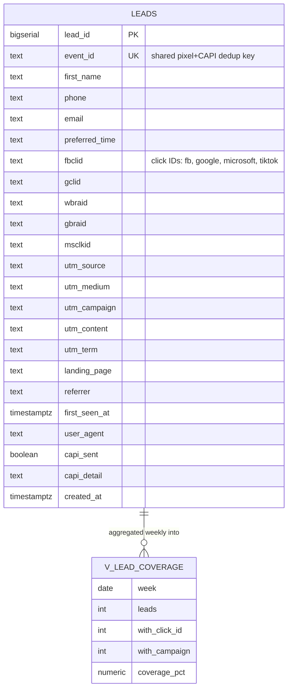

# Dental Funnel — New-Patient Acquisition with Attribution That Survives to Attendance

A production-ready dental landing page + lead API with first-touch attribution, Meta Pixel + Conversions API deduplication, and a coverage view that publishes its own blind spot.

**Stack:** Next.js 15 (App Router) · Postgres (Neon) · Meta Pixel + CAPI · Vercel

> 🔗 **Live:** [paste Vercel URL here]
> 🎥 **Demo video:** [paste Loom URL here — used in Aspire application]

---

## 1. What this is

Most dental funnels fire a `Lead` event on form submit and stop. That teaches Meta to find people who fill in forms — and it gets very good at it, while the practice cares about people who walk in.

This funnel carries the click ID through every hop so ad spend can be joined to actual attendance:

```
ad click ──▶ landing page ──▶ form ──▶ leads row ──▶ appointment ──▶ attended
                  │                 │                                        │
         first-touch capture   stored, not derived              CAPI offline conversion
                                                                             │
                                                  Meta optimises on people who turn up
```

**Offer:** New patient exam + X-rays, **$59**. Chosen as a media-buying decision: highest-volume dental offer in North America, concrete price kills the objection before it forms, low commitment (an appointment, not a treatment decision). Whitening attracts one-visit patients; implants have a consideration cycle a landing page can't close.

**Angle:** price is the stated objection, shame is the real one. The subhead — *"No lecture about how long it's been"* — and the final FAQ answer the embarrassment barrier almost no dental ad addresses.

---

## 2. How it works

1. Visitor lands with ad click IDs (`fbclid`, `gclid`, …) and UTM params in the URL.
2. `lib/attribution.ts` captures **first touch** on page load and persists it (so a later organic return still credits the ad).
3. `components/LeadForm.tsx` submits name + phone + email + preferred time plus the hidden attribution payload.
4. `app/api/lead/route.ts` **saves the lead first**, then fires CAPI. If Meta is down, the practice still gets the patient — a funnel that loses a lead because a pixel failed has its priorities backwards.
5. Pixel (browser) and CAPI (server) share one `event_id`, so Meta deduplicates instead of double-counting (which would halve your reported CPL and look fine while being wrong).

### Three decisions worth defending on a call

| Decision | Why |
|---|---|
| **First touch wins, not last** | A clicker who returns via brand search belongs to the ad. Last-touch defunds the campaign that produced them. Exception: a paid visit after an *untracked* one takes credit — there was no campaign to credit before. |
| **Pixel + CAPI share `event_id`** | Without a shared key everything counts twice. A CPL that looks half-price is worse than no tracking because nobody questions it. |
| **Save before tracking** | The lead row is the product; the tracking event is metadata. Order matters. |

---

## 3. Database (ERD)

One table, one view. Attribution is **stored on the lead**, never reconstructed later.



**`v_lead_coverage`** reports, per week, what share of leads carry a click ID. Expect 80–90% — redirects strip query strings, in-app browsers drop them, some people see the ad and phone instead of clicking. **That gap is published next to every number.** A report that doesn't say how much it couldn't see is hiding how much it's guessing.

Indexes: `leads_created_idx` (recency), `leads_campaign_idx` partial (campaign reporting).

Schema: [`db/schema.sql`](db/schema.sql)

---

## 4. Project map

```
app/page.tsx            landing page — 8 sections (hero, offer, how it works, reviews, FAQ…)
app/thank-you/          confirmation + booking-calendar embed
app/api/lead/route.ts   validate → save → CAPI (soft-fail) → respond
components/LeadForm.tsx four fields + hidden attribution payload
components/Reviews.tsx  structure with visible "sample" banner (see §6)
lib/attribution.ts      first-touch capture + persistence
lib/capi.ts             Conversions API, SHA-256-hashed contact data
db/schema.sql           leads table + v_lead_coverage
copy.md                 every section's copy, verbatim
follow-up.md            W1–W4 message sequences + library
tracking.md             events, dedup keys, offline-conversion loop
```

---

## 5. Run it locally

Prerequisites: Node 20+, a Postgres connection string (Neon free tier works).

```bash
npm install
cp .env.example .env.local   # set DATABASE_URL (only required var)
psql "$DATABASE_URL" -f db/schema.sql
npm run dev                  # http://localhost:3000
```

Submit the form, then check:

```sql
SELECT lead_id, first_name, utm_campaign, fbclid, capi_sent FROM leads ORDER BY 1 DESC LIMIT 5;
SELECT * FROM v_lead_coverage LIMIT 4;
```

### Environment variables

| Var | Required | Purpose |
|---|---|---|
| `DATABASE_URL` | ✅ | Postgres (Neon). Lead storage. |
| `NEXT_PUBLIC_META_PIXEL_ID` | – | Browser pixel. Page works without it. |
| `META_CAPI_TOKEN` | – | Server events. Without it CAPI is a quiet no-op, lead still saves. |
| `NEXT_PUBLIC_PRACTICE_NAME` | – | Hero branding override. |

---

## 6. On the reviews (read this before going live)

`components/Reviews.tsx` ships as **structure with a visible "sample" banner**, not invented testimonials. Fabricated reviews are a fabricated endorsement — and the fastest way for a local business to lose the trust the page exists to build. Stock-photo faces do the same. On a live build both come from the practice.

When swapping in real reviews, pick ones that answer objections, not ones that say "great service": one about cost, one about anxiety, one about a long gap. The component labels which is which.

---

## 7. Deploy to Vercel

This repo deploys as-is from the root. No build settings to change.

1. Vercel → Add New → Project → Import this repo (framework preset: Next.js).
2. Environment Variables → add `DATABASE_URL` (Production). Add pixel/CAPI vars only if you have them.
3. Deploy → **Redeploy after adding variables** (Vercel doesn't apply them retroactively).
4. Paste the production URL at the top of this README and into the Aspire form.

```bash
# CLI alternative
npx vercel
npx vercel env add DATABASE_URL
npx vercel --prod
```

---

## 8. Verification

```
tsc --noEmit    exit 0
next build      6/6 pages (landing static, /api/lead dynamic)
module tests    6/6 — first-touch persistence, paid override,
                direct-traffic recording, event_id uniqueness, CAPI soft-fail
```

---

## 9. Where this sits

- Provisions its follow-up in [`../ghl-provisioner`](../ghl-provisioner) (W1–W4: speed-to-lead → confirmation → reminders → no-show recovery).
- Its attendance data is what [`../pay-per-show`](../pay-per-show) reconciles into invoices.
- Built for the **Aspire Media** application (FB Ad Specialist + Landing Page Builder): this URL is the funnel deliverable, and the 1,388 → 57 → 13 reconciliation in `aspire/case-study.md` is the proof-of-results deliverable.

---

Built by [Abdiwahid Ali](https://github.com/maqbuuul). Nairobi.
