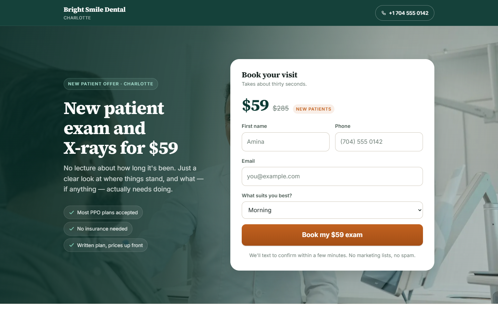
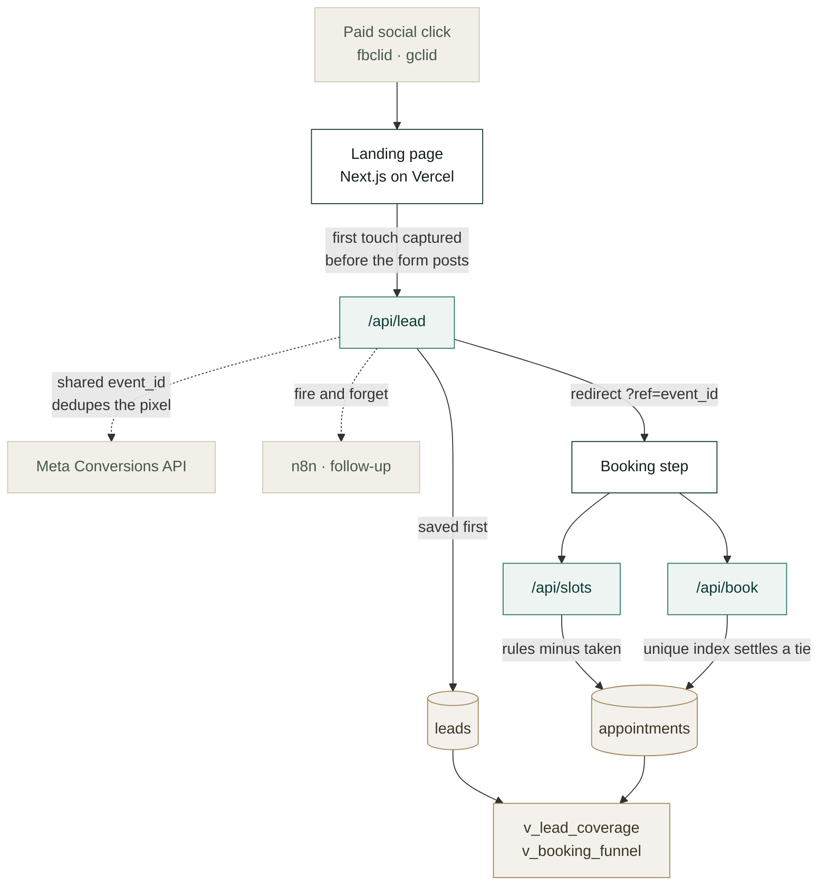
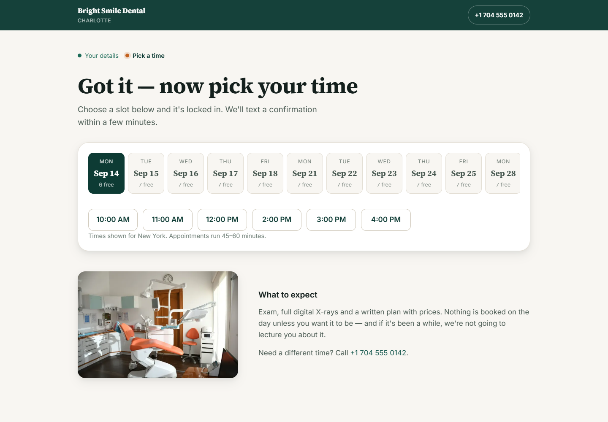

# Dental Funnel

**A new-patient acquisition funnel where the click id survives all the way to
the appointment — so the ad platform can optimise on people who turn up rather
than people who fill in forms.**

[](https://nextjs.org)
[](https://react.dev)
[](https://typescriptlang.org)
[](https://neon.tech)
[](https://vercel.com)
[](https://developers.facebook.com/docs/marketing-api/conversions-api)
[](LICENSE)

**→ [dental-funnel-eight.vercel.app](https://dental-funnel-eight.vercel.app)**



---

## The problem

A clinic buying paid social gets billed on form fills. So the platform learns to
find people who fill in forms — and gets very good at finding people who fill in
forms and never turn up.

Fixing that needs the click id to survive four hops: ad → page → lead → booking.
Most funnels lose it at the first one.

## Architecture



## Design decisions

**The lead is saved before tracking is attempted.** If Meta is down the practice
still gets the patient. A funnel that loses a lead because a pixel failed has its
priorities backwards.

**First touch wins, not last.** Someone who clicks an ad, leaves, and returns by
searching the practice name belongs to the ad. Last-touch hands that conversion
to organic and quietly defunds the campaign that produced it. The one exception:
a paid visit arriving after an *untracked* one takes credit, because there was no
campaign to credit before.

**Pixel and CAPI share an `event_id`.** Both report the same conversion. Without
a shared key you count everything twice and the CPL you report is half the real
one — worse than no tracking, because it looks fine.

**Contact data is hashed server-side**, in `lib/capi.ts`, not in the browser. A
browser-side hash can be read by any extension on the page, and the practice
needs the phone number unhashed anyway so somebody can ring the patient.

**The booking step is ours, not an embed.** A third-party iframe looks like a
different website bolted on — and the whole argument here is that a lead who
picks their own time attends more often than one waiting for a callback, so the
booking step deserves the same care as the form before it.



**The database settles a tie.** A partial unique index on `starts_at where
status = 'booked'` means two people choosing the same slot in the same second
cannot both win. Application logic that checks-then-inserts races with itself.

**The server re-derives whether a slot is offerable.** `isBookableSlot` runs
again on POST, so a crafted request cannot book 3am on a Sunday.

**Times are built in the practice timezone and returned as UTC instants**, with
the offset resolved twice to survive a DST boundary. Constructing `Date`s in the
server's local zone is the bug that books people at the wrong hour and never
raises anything — it just produces a no-show.

## Coverage

`v_lead_coverage` reports what percentage of leads carry a click id. Expect
80–90%. Some always arrive untraceable — redirects strip query strings, some
in-app browsers drop them, and some people see the ad and phone the practice
instead of clicking.

**That gap is published next to every number.** A report that doesn't say how
much it couldn't see has decided not to tell you how much it's guessing.

## Run it

```bash
npm install
cp .env.example .env          # DATABASE_URL is the only required value
psql "$DATABASE_URL" -f db/schema.sql
npm run dev
```

Deploy:

```bash
npx vercel
npx vercel env add DATABASE_URL production
npx vercel --prod
```

Everything except `DATABASE_URL` is optional. With no pixel configured the page
still works and CAPI degrades to a quiet no-op rather than throwing.

## Layout

| Path | |
|---|---|
| `app/page.tsx` | Landing page — hero, offer, steps, FAQ |
| `app/thank-you/` | Step two: our own calendar |
| `app/api/lead/` | Saves the lead, *then* fires CAPI |
| `app/api/slots/` | Availability, generated from the practice's rules |
| `app/api/book/` | Books a slot; the database settles a tie |
| `lib/attribution.ts` | First-touch capture |
| `lib/capi.ts` | Conversions API, hashed contact data |
| `lib/booking.ts` | Slot generation and the bookable-slot guard |
| `db/schema.sql` | `leads`, `appointments`, two reporting views |
| `copy.md` · `tracking.md` · `follow-up.md` | Copy, event plan, follow-up sequences |

## On the reviews section

`components/Reviews.tsx` ships as **structure**, not invented testimonials, and
the live page shows the terms of the offer instead.

Fabricated reviews on a public page are a fabricated endorsement, and they are
also the fastest way for a local business to lose the trust the page exists to
build. Stock-photo faces do the same. On a live build both come from the
practice's own Google listing.

## Verified

Against the deployed URL, not a build log:

```
tsc --noEmit          exit 0
next build            6 routes, landing page static
lead submitted        → row in leads, fbclid intact
duplicate event_id    → no second row
slot booked           → disappears from availability
3am Sunday POST       → refused: not_bookable
v_booking_funnel      → 7 leads, 2 booked, 28.6%
```

Reviewed at 1440 and 390 wide.

---

Built by [Abdiwahid Ali](https://github.com/maqbuuul). Nairobi.
Photography from [Unsplash](https://unsplash.com).
